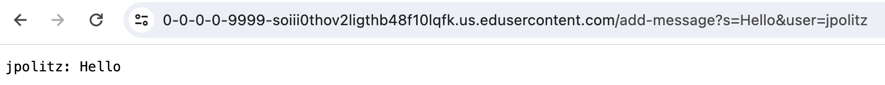

# Lab 2 Report
## Part 1
The following is my code for the Chat Server:
```
import java.io.IOException;
import java.net.URI;
import java.util.*;

class Handler implements URLHandler {
    ArrayList<String> users = new ArrayList<>();
    ArrayList<String> texts = new ArrayList<>();

    public String handleRequest(URI url) {

        if (url.getPath().equals("/add-message")) {
            String[] parameters = url.getQuery().split("&");

            String user = parameters[1].split("=")[1];
            users.add(user);

            String s = parameters[0].split("=")[1];
            texts.add(s);


            String returnString = "";
            for (int i = 0; i < users.size(); i++) {
                returnString += users.get(i) + ": " + texts.get(i) + "\n";
            }

            return returnString;
        } else {
            return "404 Not Found!";
        }

    }
}

class ChatServer {
    public static void main(String[] args) throws IOException {
        if(args.length == 0){
            System.out.println("Missing port number! Try any number between 1024 to 49151");
            return;
        }

        int port = Integer.parseInt(args[0]);

        Server.start(port, new Handler());
    }
}
```
***
**Screenshot 1:**


First, the ```main``` method is called in ```ChatServer``` with the argument of the port number, 9999 in this case. Then, ```Server```'s start method is called with the arguments of the port number and a new ```Handler``` object. The ```handleRequest``` method is called in the ```Handler``` object with the ```URI``` that can be seen in the screenshot. The ```Handler``` class has two ```ArrayList``` objects as fields that initially have no ```String```s in them. After the ```handleRequest``` method is called, the ```URI``` is processed so that the user and the message are added to the users and texts ```ArrayList```s respectively. The ```String``` called ```returnString``` does not have any characters in it because it is created in the ```handleRequest``` method this way. After the for each loop that goes through the ```ArrayList``` of users and adds the text from the other ```ArrayList``` with the same index, ```returnString```'s value is:
```
jpolitz: Hello
```
followed by a return to the next line. The ```String returnString``` is now updated.

***
**Screenshot 2:**


This use of ```/add-message``` is after the one in the first screenshot. First, the ```main``` method is called in ```ChatServer``` with the argument of the port number, 9999 in this case. Then, ```Server```'s start method is called with the arguments of the port number and a new ```Handler``` object. The ```handleRequest``` method is called in the ```Handler``` object with the ```URI``` that can be seen in the screenshot. The ```Handler``` class has two ```ArrayList``` objects as fields that initially each have one ```String``` in them because this the second time ```/add-message``` is being used. After the ```handleRequest``` method is called, the ```URI``` is processed so that the user and the message are added to the users and texts ```ArrayList```s respectively. The ```String``` called ```returnString``` does not have any characters in it because it is created in the ```handleRequest``` method this way. After the for each loop that goes through the ```ArrayList``` of users and adds the text from the other ```ArrayList``` with the same index, ```returnString```'s value is:
```
jpolitz: Hello
yash: How+are+you
```
followed by a return to the next line. This is because the for loop iterates through the ```ArrayList``` of users and adds their respective texts to the ```returnString``` ```String``` as well. The ```String returnString``` is now updated.

***
**Screenshot 3:**


This screenshot demonstrates that my implementation of ```ChatServer``` works when the same user puts in more than one message (which was not the case with my intial submission because I used a ```HashMap``` rather than the ```ArrayLists``` I am currently using).

## Part 2
_Absolute path to the private key_

***

_Absolute path to the public key_

***

_Terminal interaction without password_


## Part 3
I learned what the different parts of a url meant, such as the domain, path and query. It was interesting to learn that each part of a url has significance and also learn how to use the urls to create different servers like the Search Engine and the Chat Server.
