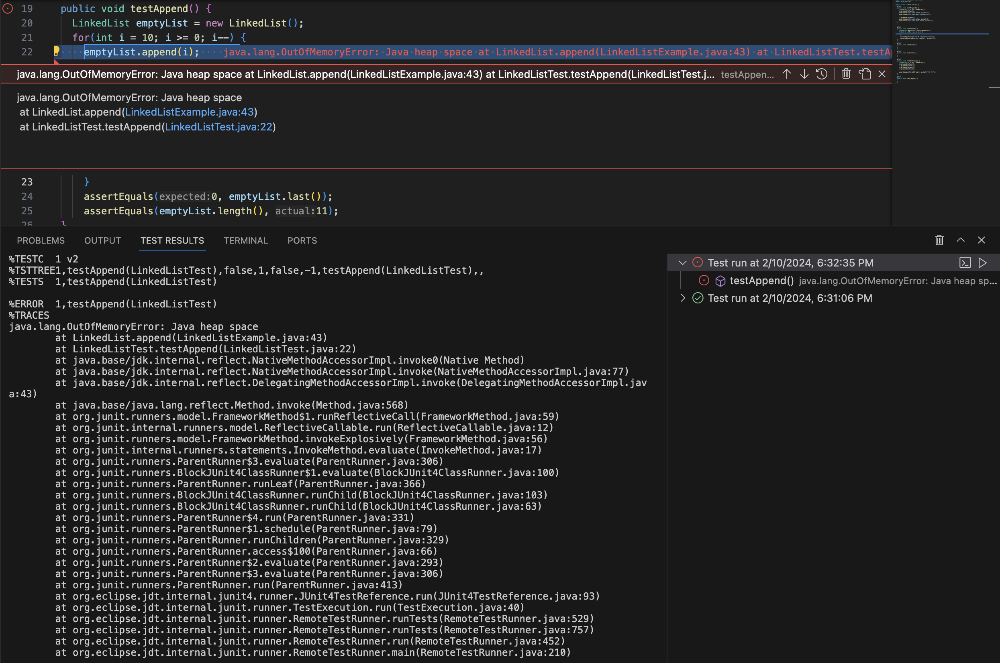
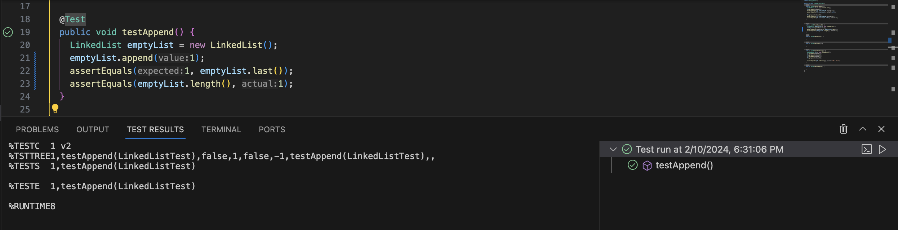

# Lab 3 Report
## Part 1

For this part of the lab, I am analyzing the ```append``` method of the ```LinkedList``` implementation.

**Failure Inducing Input:**
```
@Test
  public void testAppend() {
    LinkedList emptyList = new LinkedList();
    for(int i = 10; i >= 0; i--) {
      emptyList.append(i);
      }
      assertEquals(0, emptyList.last());
      assertEquals(emptyList.length(), 11);
  }
```


**Input that does not Induce Failure:**
```
@Test
  public void testAppend() {
    LinkedList emptyList = new LinkedList();
    emptyList.append(1);
    assertEquals(1, emptyList.last());
    assertEquals(emptyList.length(), 1);
  }
```

**Symptom:**\
Failure Inducing Input:


Input that does not Induce Failure:


**Bug:**\
Code Before Fix:
```
public void append(int value) {
        if(this.root == null) {
            this.root = new Node(value, null);
            return;
        }
        // If it's just one element, add if after that one
        Node n = this.root;
        if(n.next == null) {
            n.next = new Node(value, null);
            return;
        }
        // Otherwise, loop until the end and add at the end with a null
        while(n.next != null) {
            n = n.next;
            n.next = new Node(value, null);
        }
    }
```

Code After Fix:
```
public void append(int value) {
        if(this.root == null) {
            this.root = new Node(value, null);
            return;
        }
        // If it's just one element, add if after that one
        Node n = this.root;
        if(n.next == null) {
            n.next = new Node(value, null);
            return;
        }
        // Otherwise, loop until the end and add at the end with a null
        while(n.next != null) {
            n = n.next;
        }
        n.next = new Node(value, null);
    }
```

**Explanation:**
The original code was creating a new ```Node``` with the inputted value every time it moved up a ```Node```, but a new ```Node``` should only be added once at the end. Since it was added every time, you could never get to the last ```Node```. To fix the bug, the second line in the while loop should be moved outside the while loop.

## Part 2
For this part I am exploring the ```grep``` command.

**grep -o**\
Example 1:
```
navyaa@Navyaas-Computer docsearch % grep -o 'Management' technical/government/About_LSC/Comments_on_semiannual.txt
```
```
Management
Management
Management
Management
Management
Management
Management
Management
```
Example 2:
```
navyaa@Navyaas-Computer docsearch % grep -o 'Management Report' technical/government/About_LSC/Comments_on_semiannual.txt
```
```
Management Report
Management Report
```
ChatGPT Citation:
I inputted "what is an interesting command line option for command grep" and the output was "An interesting command line option for the grep command is -o, which stands for "only-matching". When you use grep -o, it prints only the matching parts of the lines instead of the whole line. This can be particularly useful when you're searching for patterns within large blocks of text and only want to extract specific parts that match your criteria."

Explanation: 
```-o``` prints every time it sees the specified text pattern within a text file. This command option can be useful for identifying how many times a pattern is present or to see if its present at all in a text file.

**grep -B**\
Example 1:
```
navyaa@Navyaas-Computer docsearch % grep -B 12 'Conclusion' technical/biomed/1468-6708-3-1.txt
```
```
results from many studies. However, health measures
          designed specifically to measure those conditions might
          be more sensitive to change in weight than EVGFP. If YHL
          were based on such measures, the superiority of YHL to
          YOL would likely be even greater than that shown here.
          These more sensitive measures might also have detected
          differences between the overweight and normal weight
          persons, but we think this is unlikely given the absence
          of any differences in EVGFP.
        
      
      
        Conclusion
```
Example 2:
```
navyaa@Navyaas-Computer docsearch % grep -B 6 'Profile' technical/government/Media/Assuring_Underprivileged.txt
```
```
Assuring Underprivileged a Voice
Jurist Credits Parents for Strong Sense of Social
Responsibility
By Tina Spee

Wednesday, October 2, 2002
Profile:
```
ChatGPT Citation:
I inputted "what is an interesting command line option for command grep" and the output was "Another interesting command line option for grep is -B, which stands for "before context". When you use grep -B, it prints a specified number of lines before each match in addition to the matching line itself. This can be useful for providing context around the matching lines. For example, if you have a log file and you want to see the lines leading up to each occurrence of a certain error message, you can use grep -B to display the relevant context along with the error message."

Explanation: 
```-B``` followed by an integer and string prints the line with the string and the specified number of lines before it. This can be useful to find the context in which a certain text is present, or find the lead in of a part of the text or the last part of a subsection of the text.

**grep -l**\
Example 1:
```
navyaa@Navyaas-Computer docsearch % grep -l 'Background' technical/biomed/1471-213X-1-*.txt
```
```
technical/biomed/1471-213X-1-1.txt
technical/biomed/1471-213X-1-11.txt
technical/biomed/1471-213X-1-12.txt
technical/biomed/1471-213X-1-13.txt
technical/biomed/1471-213X-1-15.txt
technical/biomed/1471-213X-1-2.txt
technical/biomed/1471-213X-1-3.txt
technical/biomed/1471-213X-1-4.txt
technical/biomed/1471-213X-1-6.txt
```
Example 2:
```
navyaa@Navyaas-Computer docsearch % grep -l '2002' technical/government/Media/*.txt
```
```
technical/government/Media/5_Legal_Groups.txt
technical/government/Media/AP_LawSchoolDebts.txt
technical/government/Media/A_helping_hand.txt
technical/government/Media/Abuse_penalties.txt
technical/government/Media/Advocate_for_Poor.txt
technical/government/Media/Annual_Fee.txt
technical/government/Media/Anthem_Payout.txt
technical/government/Media/Assuring_Underprivileged.txt
technical/government/Media/Attorney_gives_his_time.txt
technical/government/Media/Barnes_Volunteers.txt
technical/government/Media/Barnes_new_job.txt
technical/government/Media/Barnes_pro_bono.txt
technical/government/Media/Barr_sharpening_ax.txt
technical/government/Media/BergenCountyRecord.txt
technical/government/Media/Bias_on_the_Job.txt
technical/government/Media/Boone_legal_service.txt
technical/government/Media/Bridging_legal_aid_gap.txt
technical/government/Media/BusinessWire.txt
technical/government/Media/BusinessWire2.txt
technical/government/Media/Butler_Co_attorneys.txt
technical/government/Media/Campaign_Pays.txt
technical/government/Media/City_Council_Budget.txt
technical/government/Media/Civil_Matters.txt
technical/government/Media/CommercialAppealMemphis2.txt
technical/government/Media/Commercial_Appeal.txt
technical/government/Media/Crains_New_York_Business.txt
technical/government/Media/Disaster_center.txt
technical/government/Media/Domestic_Violence_Ruling.txt
technical/government/Media/Domestic_violence_aid.txt
technical/government/Media/Donald_Hilliker.txt
technical/government/Media/Entities_Merge.txt
technical/government/Media/Eviction_law.txt
technical/government/Media/FY_04_Budget_Outlook.txt
technical/government/Media/Federal_agency.txt
technical/government/Media/Few_who_need.txt
technical/government/Media/Fire_Victims_Sue.txt
technical/government/Media/Firm_to_the_Poor_Needs_Help.txt
technical/government/Media/FortWorthStarTelegram.txt
technical/government/Media/Free_Legal_Assistance.txt
technical/government/Media/Free_legal_service.txt
technical/government/Media/Funding_May_Limit.txt
technical/government/Media/Funding_cuts_force.txt
technical/government/Media/Funds_Shortage.txt
technical/government/Media/Ginny_Kilgore.txt
technical/government/Media/Good_guys_reward.txt
technical/government/Media/Greedy_Generous.txt
technical/government/Media/GreensburgDailyNews.txt
technical/government/Media/Helping_Hands.txt
technical/government/Media/Higher_Registration_Fees.txt
technical/government/Media/Higher_court.txt
technical/government/Media/IOLTA_INTEREST_RATE.txt
technical/government/Media/It_Pays_to_Know.txt
technical/government/Media/Kiosks_for_court_forms.txt
technical/government/Media/Law-school_grads.txt
technical/government/Media/Law_Schools.txt
technical/government/Media/Lawyer_Web_Survey.txt
technical/government/Media/Legal_Aid_Society.txt
technical/government/Media/Legal_Aid_attorney.txt
technical/government/Media/Legal_Aid_campaign.txt
technical/government/Media/Legal_Aid_in_Clay_County.txt
technical/government/Media/Legal_services_for_poor.txt
technical/government/Media/Legal_system_fails_poor.txt
technical/government/Media/Library_Lawyers.txt
technical/government/Media/Lockyer_Warns.txt
technical/government/Media/Low-income_children.txt
technical/government/Media/Major_Changes.txt
technical/government/Media/Making_a_case.txt
technical/government/Media/NJ_Legal_Services.txt
technical/government/Media/New_Online_Resources.txt
technical/government/Media/New_funding_sources.txt
technical/government/Media/Oregon_Poor.txt
technical/government/Media/Owning_a_Piece.txt
technical/government/Media/Philly_Lawyers.txt
technical/government/Media/Politician_Practices.txt
technical/government/Media/Poor_Lacking_Legal_Aid.txt
technical/government/Media/Poverty_Lawyers.txt
technical/government/Media/Pro-bono_road_show.txt
technical/government/Media/Pro_Bono_Services.txt
technical/government/Media/Program_Lodges.txt
technical/government/Media/Rental_rules.txt
technical/government/Media/RoanokeTimes.txt
technical/government/Media/Rumble_in_the_Bronx.txt
technical/government/Media/Self-Help_Website.txt
technical/government/Media/Service_Agency.txt
technical/government/Media/State_funding.txt
technical/government/Media/Supporting_Legal_Center.txt
technical/government/Media/Survey.txt
technical/government/Media/Texas_Lawyer.txt
technical/government/Media/Texas_Supreme_Court.txt
technical/government/Media/The_Bend_Bulletin.txt
technical/government/Media/The_Columbian.txt
technical/government/Media/Towson_Attorney.txt
technical/government/Media/Understanding.txt
technical/government/Media/Unusual_Woodburn.txt
technical/government/Media/Volunteers_Step_Up.txt
technical/government/Media/Wilmington_lawyer.txt
technical/government/Media/Wingates_winds.txt
technical/government/Media/Workers_aid_center.txt
technical/government/Media/Working_for_Free.txt
technical/government/Media/agency_expands.txt
technical/government/Media/balance_scales_of_justice.txt
technical/government/Media/defend_yourself.txt
technical/government/Media/fight_domestic_abuse.txt
technical/government/Media/grants_fail_to_come.txt
technical/government/Media/less_legal_aid.txt
technical/government/Media/not_accessible_to_disabled.txt
technical/government/Media/predatory_loans.txt
technical/government/Media/pro_bono_efforts.txt
technical/government/Media/residents_sue_city.txt
```
ChatGPT Citation:
I inputted "what is an interesting command line option for command grep" and the output was "Another interesting command line option for grep is -l, which stands for "list". When you use grep -l, it prints only the names of files containing matches, rather than the actual matching lines. This can be helpful when you want to quickly identify which files in a directory contain a certain pattern without having to view the actual content of each file."

Explanation: 
```-l``` followed by a string and a path will list all the files that follow the path that contain the string. This can be useful to see which files discuss a certain topic by searching for a keyword, date, or number. It can also be used to see what sections are present in a file such as I did in example 1 by searching for 'Background' and therefore the reports that included a background section.

**grep -r**\
Example 1:
```
navyaa@Navyaas-Computer docsearch % grep -r 'happy' technical/
```
```
technical//government/About_LSC/State_Planning_Report.txt:found that most users are happy with the overall implementation of
technical//government/Gen_Account_Office/Testimony_Jul15-2002_d02940t.txt:our lessons and experiences with others, and are happy to do
technical//government/Gen_Account_Office/July11-2001_gg00172r.txt:both subjective (is the user reasonably happy with the completed
technical//government/Post_Rate_Comm/Gleiman_gca2000.txt:Seriously, though, I know some of you are not all that happy
technical//government/Post_Rate_Comm/Gleiman_gca2000.txt:Nevertheless, I think the Governors should be quite happy with a
technical//government/Post_Rate_Comm/Gleiman_gca2000.txt:I know that some of you are unhappy with the Commission's
technical//government/Post_Rate_Comm/Mitchell_6-17-Mit.txt:For serious reviewers, the author would be happy to supply the
technical//government/Media/Working_for_Free.txt:"I just didn't get the impression that they were really happy,"
technical//government/Media/Working_for_Free.txt:get a job you are happy with and let things flow from there."
technical//government/Media/Rental_rules.txt:well-run. If residents are unhappy, they can "put wheels on their
technical//government/Media/man_on_national_team.txt:share the experience with his wife, and Mickie was more than happy
technical//government/Media/man_on_national_team.txt:happy and proud to be assigned to anything by the president,"
technical//government/Media/GreensburgDailyNews.txt:a trial judge I am always happy to see equity in the courts. It is
technical//government/Media/Pro-bono_road_show.txt:"It's refreshing that all these clients are just happy to have
technical//plos/journal.pbio.0020140.txt:        mood of two people presented in a pair and, as much as possible, to select the ‘happy’
technical//plos/journal.pbio.0020140.txt:        person, who would then smile. Over time, the person with the ‘happy’ mood (who would smile
technical//plos/pmed.0020158.txt:        reports and their identities, we are happy to cooperate, subject to the permission of the
technical//plos/journal.pbio.0020053.txt:        Administration unhappy. “Phage normally are very fragile, their tails break, so lot-to-lot
technical//plos/pmed.0020203.txt:        important study at this interface between biology and medicine, and will be happy to talk
technical//plos/pmed.0010052.txt:        Elliott professes to be unhappy about enhancement. What arguments does he present to
technical//plos/journal.pbio.0020262.txt:        are happy to be called dwarfs or little people, but midget is no longer an acceptable term.
technical//plos/journal.pbio.0030065.txt:        still tend to be unhappy. However, analyses have shown that this score is in the range of
technical//plos/journal.pbio.0030129.txt:        identities, we are happy to cooperate, subject to the permission of the reviewers. This can
technical//plos/pmed.0020209.txt:            an entire institution whose mission is to approve drugs and make industry happy.”
technical//plos/pmed.0020118.txt:        medical schools may not be producing doctors who are happy with the profession, or who fit
technical//plos/journal.pbio.0020164.txt:        happy—would not cross the scientific mind. Yet in biology we often pose “why” questions in
technical//911report/chapter-3.txt:                "little benefit, lots of blowback against [a] bomb-happy U.S."
technical//911report/chapter-6.txt:                Krongard, had said that either one of them would be happy to pull the trigger, but
```
Example 2:
```
navyaa@Navyaas-Computer docsearch % grep -r 'urgent' technical/biomed
```
```
technical/biomed/1472-6807-2-3.txt:          sequences determined [ 59 ] . Thus there is an urgent
technical/biomed/1476-0711-2-7.txt:        hospital antibiotic use policy is a matter of urgent
technical/biomed/1471-2458-2-6.txt:        we propose is urgently needed.
technical/biomed/1471-2490-3-2.txt:        that require urgent and prompt treatment could affect the
technical/biomed/1471-2458-2-3.txt:            ○ limiting urgent reporting of diseases to those
technical/biomed/1471-2296-3-18.txt:        risk of cardiovascular diseases. There is an urgent need to
technical/biomed/1472-6963-3-7.txt:            or on an urgent basis by a physician as an outpatient
technical/biomed/cc2171.txt:        common in American medicine [ 49 ] , even in urgent
technical/biomed/cc2171.txt:        urgently may be helpful. Guidelines for the management of
technical/biomed/1477-7525-1-10.txt:        to implement on a broad scale [ 14 ] . Given the urgent
technical/biomed/1472-684X-2-2.txt:        is needed urgently. Our target in sedation is calming and
technical/biomed/1472-6947-2-7.txt:            technology also represent an urgent concern. The Health
technical/biomed/rr37.txt:          (ED) services for urgent asthma care. We defined reliance
technical/biomed/rr37.txt:          the interview interval but no urgent outpatient clinic or
technical/biomed/rr37.txt:          appeared to rely on the ED for urgent asthma care.
technical/biomed/rr37.txt:          urgent asthma care was also related to greater risk.
technical/biomed/rr37.txt:        for asthma. Reliance on the emergency department for urgent
technical/biomed/rr37.txt:        reliance on emergency department for urgent asthma care,
technical/biomed/1471-2180-3-5.txt:        organism. Consequently, there is an urgent need for the
technical/biomed/1472-6947-2-4.txt:          middle of the interview to address urgent clinic needs.
technical/biomed/1472-6947-2-4.txt:          for routine, preventive and urgent appointments."
technical/biomed/bcr303.txt:        urgent need for clinical applications.
technical/biomed/cvm-2-4-180.txt:          events, urgent revascularisations, or site investigator
technical/biomed/1471-2458-1-9.txt:        scheduled, same day, and urgent care visits, is delivered
technical/biomed/1471-2458-1-9.txt:        routine, scheduled, and urgent care visits, plus telephone
technical/biomed/bcr605.txt:        mechanisms. That report suggested an urgent need to fully
```
ChatGPT Citation:
I inputted "what is an interesting command line option for command grep" and the output was "Another interesting command line option for grep is -m, which stands for "max count". When you use grep -m, it stops reading the input after matching a specified number of lines. This can be useful when you only need to find the first few occurrences of a pattern in a large file or when you want to limit the amount of output produced by grep."

Explanation: 
```-r``` followed by a string to search for and a directory path will recursively search through any file in the specified directory for the specified string. This can be useful when their is a word that flags an issue or to search for mentions of a specific topic or in what scenarios a specific word is used.
