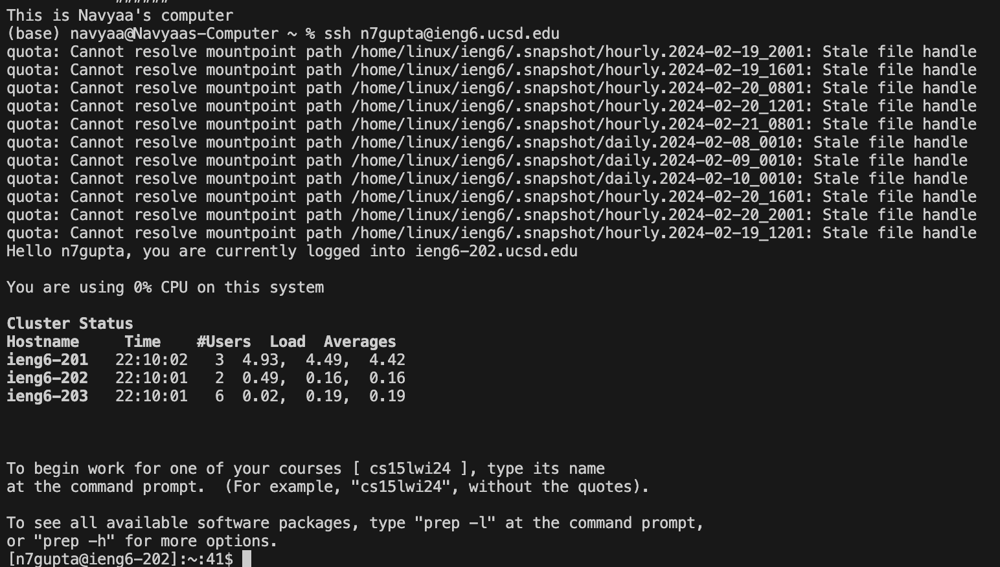
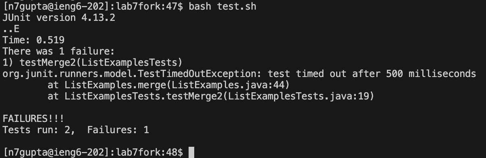
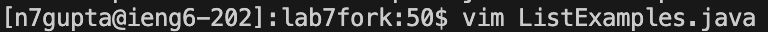
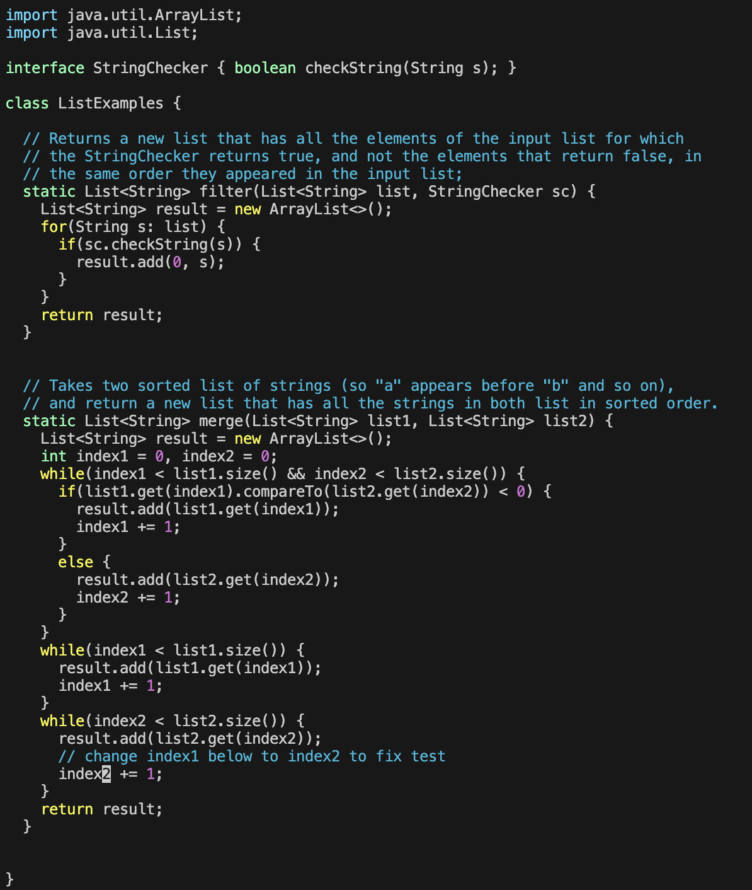
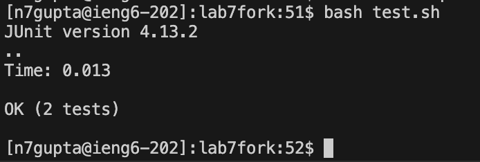
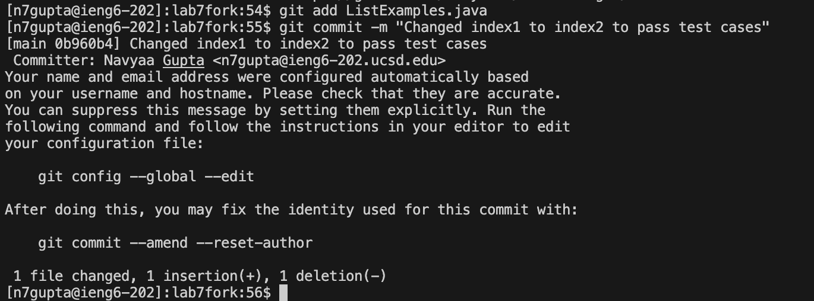

# Lab Report 4
## Step 4
I logged into ineg6 by typing in the line ```ssh n7gupta@ieng6.ucsd.edu```.

## Step 5
I cloned my fork by typing ```git clone``` followed by the url to my fork which was ```https://github.com/navyaa31/lab7fork```.

## Step 6
To run the tests, I typed ```bash test.sh```. The following are the results that demonstrate a test failed.

## Step 7
To edit ```ListExamples.java```, I typed in the following command.
 <br>
The following are the keys I typed next: 43jer2:wq!
43j moved the cursor down 43 lines to the line I wanted to edit. e moved to the end of the next word, which was the end of index1. r indicated that the character the cursor was on was to be changed. 2 was the next character, which is what the haracter at the cursor was changed to. :wq! saved the changes and exited the vim editor. The following is how the code looked before I exited but after the edit.

## Step 8
To run the tests again, I typed ```bash test.sh``` again. The following are the results that demonstrate the tests pass.

## Step 9
The following is how I commited my changes.

Then to push my changes, I typed ```git push origin main```.
