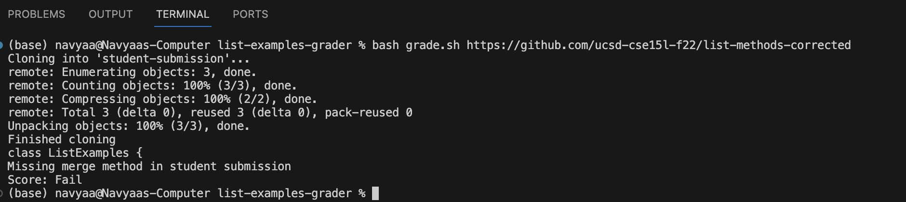
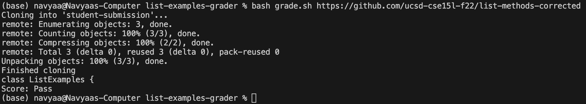

# Lab Report 5
## Student Post
I am working on making a grading script and I want to check to see if the java file in the student submission contains specific methofd headers. However, I want to generalize the check to work for any variable argument names. How do I got about this?
Here is my file structure:
- list-examples-grader
  - GradeServer.java
  - Server.java
  - TestListExamples.java
  - grade.sh
  - grading-area
    - ExecExamples.class
    - GradeServer.class
    - Handler.class
    - ListExamples.class
    - Server.class
    - ServerHttpHandler.class
    - TestListExamples.class
    - URLHandler.class
    - ExecHelpers.class
    - GradeServer.java
    - IsMoon.class
    - ListExamples.java
    - Server.java
    - StringChecker.class
    - TestListExamples.java
    - lib
      - hamcrest-core-1.3.jar
      - junit-4.13.2.jar
  - lib
    - hamcrest-core-1.3.jar
    - junit-4.13.2.jar
  - student-submission
    - ListExamples.java
Here is my grading script and the command line where I ran the script and got the following errors. I used a sample input from the week 6 lab where everything should pass, but the argument names in the method headers are different.

```
CPATH='.:lib/hamcrest-core-1.3.jar:lib/junit-4.13.2.jar'

rm -rf student-submission
rm -rf grading-area

mkdir grading-area

git clone $1 student-submission
echo 'Finished cloning'

cp student-submission/*.java grading-area
cp *.java grading-area
cp -r lib grading-area

cd grading-area

if ! [ -f ListExamples.java ]
then 
    echo "Missing ListExamples.java in student submission"
    echo "Score: Fail"
    exit
fi 

if ! grep 'class\s*ListExamples' "ListExamples.java";
then 
    echo "Missing ListExamples class in student submission"
    echo "Score: Fail"
    exit
fi

grep -q 'static List<String> filter(List<String> list, StringChecker sc)' ListExamples.java
if [ $? -ne 0 ]
then 
    echo "Missing filter method in student submission"
    echo "Score: Fail"
    exit
fi

grep -q 'static List<String> merge(List<String> list, List<String> sc)' ListExamples.java
if [ $? -ne 0 ]
then 
    echo "Missing merge method in student submission"
    echo "Score: Fail"
    exit
fi

javac -cp $CPATH *.java
if [ $? -ne 0 ]
then 
    echo "Compilation Error"
    echo "Score: Fail"
    exit
fi

echo "Score: Pass"
```


## TA Response
Interesting problem! One way to go about this issue is to use RegEx, which I suggest to research. In order to use RegEx with grep, you will have to use the -E option. Then, you will have to use the backslash character before each special character, such as the parentheses in this case, in the string you are searching for. Lastly, instead of using a set variable name, try researching how to represent the variable names with RegEx. Let us know if you have any more questions!.

## Student Fix
I changed my grading script to use the -E option with the grep command. Here is my changed code, I only had to change the two lines that checked for the two method headers. The terminal shows that I ran the script with the same input and got a passing result this time.

```
CPATH='.:lib/hamcrest-core-1.3.jar:lib/junit-4.13.2.jar'

rm -rf student-submission
rm -rf grading-area

mkdir grading-area

git clone $1 student-submission
echo 'Finished cloning'

cp student-submission/*.java grading-area
cp *.java grading-area
cp -r lib grading-area

cd grading-area

if ! [ -f ListExamples.java ]
then 
    echo "Missing ListExamples.java in student submission"
    echo "Score: Fail"
    exit
fi 

if ! grep 'class\s*ListExamples' "ListExamples.java";
then 
    echo "Missing ListExamples class in student submission"
    echo "Score: Fail"
    exit
fi

grep -q -E 'static List<String> filter\(List<String> \w+, StringChecker \w+\)' ListExamples.java
if [ $? -ne 0 ]
then 
    echo "Missing filter method in student submission"
    echo "Score: Fail"
    exit
fi

grep -q -E 'static List<String> merge\(List<String> \w+, List<String> \w+\)' ListExamples.java
if [ $? -ne 0 ]
then 
    echo "Missing merge method in student submission"
    echo "Score: Fail"
    exit
fi

javac -cp $CPATH *.java
if [ $? -ne 0 ]
then 
    echo "Compilation Error"
    echo "Score: Fail"
    exit
fi

echo "Score: Pass"
```



## My Reflection
Something cool I learned was RegEx. I was struggling with the same issue that I discussed in this report. I asked a TA about this issue and they introduced me to RegEx. It looks like a really useful tool, and I look forward to using it in the future. I like how RegEx can cover so many different cases with simple expressions. It looks like there is a lot to learn with RegEx and I look forward to doing so!
